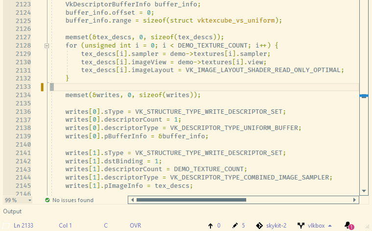

PeasyMotion (doc tab & code navigation)
===
[](https://ci.appveyor.com/project/msomeone/peasymotion/branch/master)



Implements "word-motion", line motions, two char search modes ~same way as it is done in vim-easymotion.
Implements fast text selection via jump label motion.
Implements jumping to open document via jump label combo.
This extension differs from other motion/jump extensions as it assigns jump labels to all words in text viewport, without asking specific "jump" key (in word-motion mode).
Such a behaviour may lead to faster motion and navigation in certain scenarios.
Inspired by original [vim-easymotion](https://github.com/easymotion/vim-easymotion) script for VIM.

## Installing
**WARNING** **For some reason marketplace keeps serving version 1.7.88 of the extension. Please disable extension auto-update and install using links below. If someone knows how to fix or workaround this, let me know please!**

Recommended way - download this extension from the VSIX Gallery:

[VS 2019] https://www.vsixgallery.com/extension/PeasyMotion.a87d2837-6b54-4518-b014-3b29b4dcd902

[VS 2022] https://www.vsixgallery.com/extension/PeasyMotion.14f4a247-6617-4f0c-aac4-76844ffe053c

or get the [CI build](http://vsixgallery.com/extension/PeasyMotion.a87d2837-6b54-4518-b014-3b29b4dcd902/).

**IMPORTANT**


## Key binding & options (for VsVim or ViEmu see 'Compatibility with other plugins' section)
Assign key combination through **Tools**->**Options**->**Keyboard** 
commands available: 
* **Tools.InvokePeasyMotion**
* **Tools.InvokePeasyMotionTextSelect**
* **Tools.InvokePeasyMotionLineJumpToWordBegining**
* **Tools.InvokePeasyMotionLineJumpToWordEnding**
* **Tools.InvokePeasyMotionJumpToDocumentTab**
* **Tools.InvokePeasyMotionJumpToLineBegining**
* **Tools.InvokePeasyMotionTwoCharJump**
* **Tools.InvokePeasyMotionOneCharJump**

Two jump label assignment algorithms are available (**Tools**->**Options**->**PeasyMotion options**):
* Caret relative - place labels based on proximity to caret (closer to caret -> shorter the label).
* Viewport relative - labels assigned from top to bottom of visible text in viewport. 

In caret relative mode you can adjust 'proximity' sensitivity  via "Caret position sensitivity " option.
When caret sensitivity  is not equal to 0, caret position is quantized into blocks of (sensitivity +1) caret positions and is treated as being located in the middle of encasing block.

#### **Colors** for jump labels
One can configure jump label colors, with live preview also. Color options for 'First motion' and 'Final motion' jump labels are available.
Just invoke PeasyMotion and goto **Tools**->**Options** and adjust style with live preview.
When 'Color source' options is not equal to **PeasyMotionJumpLabel****Motion**, one can sync label color style to other classification items from **Tools**->**Options**->**Fonts And Colors**->**Text Editor**.
When 'Color source' is equal to PeasyMotionJumpLabel****Motion one can configure classification style manually trough **Tools**->**Options**->**PeasyMotion** or **Tools**->**Options**->**Fonts And Colors**->**Text Editor**->**'PeasyMotion **** Motion Jump label color'**.

## Assign allowed jump label characters 
One can assign allowed jump label characters through **Tools**->**Options**->**PeasyMotion options**->**Allowed jump label characters**
If one observes any kind of unexpected behaviour when pressing certain key/labels during motion, there is an option to replace/remove unwanted characters from list. Beware that order of characters in this options affects ergonomics of jump-motions. Lowercase letters, digits and punctuation symbols are all valid jump label characters.

## Compatibility with other plugins
VsVim and ViEmu
just bind PeasyMotion command in your .vimrc (or .vsvimrc) file:
```vimscript
" gS prefix is added for ViEmu, no use for VsVim AFAIK.
"VsVim and ViEmu are disabled until PeasyMotion finishes

"Whole viewport jump-to-word beginning mode:
nnoremap <Space> gS:vsc Tools.InvokePeasyMotion<CR>

"Select text from current caret position to desired jump label (fwd and reverse directions supported)
nmap ;; gS:vsc Tools.InvokePeasyMotionTextSelect<CR>

"Jump to word beginning in current line
nmap zw gS:vsc Tools.InvokePeasyMotionLineJumpToWordBegining<CR>
"Jump to word ending in current line
nmap ze gS:vsc Tools.InvokePeasyMotionLineJumpToWordEnding<CR>

"Jump to any open document tab
nmap ;w gS:vsc Tools.InvokePeasyMotionJumpToDocumentTab<CR>

"Jump to line beginning:
nmap ;l gS:vsc Tools.InvokePeasyMotionJumpToLineBegining<CR>

"Two char search mode:
nmap ;c gS:vsc Tools.InvokePeasyMotionTwoCharJump<CR>

"One char search mode:
nmap ;v gS:vsc Tools.InvokePeasyMotionOneCharJump<CR>

```
## Text selection via Tools.InvokePeasyMotionTextSelect command
Invoking **Tools.InvokePeasyMotionTextSelect** command lets you to specify jump label to select in **[ current caret position -> jump label ]** range **(!)** in forward and reverse directions.

## Jump to word beginning or ending in current line
Jump to word beginning  or ending in current line via Tools.InvokePeasyMotionLineJumpToWordBegining or Tools.InvokePeasyMotionLineJumpToWordEnding

## Jump to document tab
Jump to any open document tab via Tools.InvokePeasyMotionJumpToDocumentTab
The only way to prevent UI 'jumping' when tabs caption are changed is to use monospaced font for Tools->Fonts And Colors -> show settings for Environment. This will help making tab captions keep stable.
In case of non-monospaced fonts in 'Environment' - when jump labels are assigned to document tab title -> title's width can change it's width (get shorter or longer, depends on particular characters combination in caption). When document tab title changes, the re-adjustment of tab document title positions happen -> jump labels and whole doc tab title shifts either side. When user's gaze was fixed on the jump label or document tab title user will lose his 'point of focus'/ gaze point.
When monospaced fonts are used in environment -> each character lower/upper of any kind occupies strictly the same space in title. This prevents any changes/adjustments to captions widths/doc title positions in combination with fact, that jump label replaces part of document name (to help with keeping document title the same width as it was).

## Jump to beginning of line
Jump to beginning of any visible line via Tools.InvokePeasyMotionJumpToLineBegining

## Two char search
Execute two character search for visible text portion via Tools.InvokePeasyMotionTwoCharJump. Jump labels are placed at each match.
When activated, two keys are queried, search and all matched are labeled. After that PM awaits for jump label keys to execute final motion and deactivate.

## Bugreports, Feature requests and contributions
PeasyMotion can be developed using Visual Studio 2017 or 2019. Contributions are welcomed.
Check out the [contribution guidelines](CONTRIBUTING.md)

## License
All code in this project is covered under the MIT license a copy of which 
is available in the same directory under the name LICENSE.txt.

## Latest Builds
The build representing the latest source code can be downloaded from the
[Open Vsix Gallery](http://vsixgallery.com/extension/PeasyMotion.a87d2837-6b54-4518-b014-3b29b4dcd902/).

## Building
For cloning and building this project yourself, make sure
to install the
[Extensibility Essentials](https://marketplace.visualstudio.com/items?itemName=MadsKristensen.ExtensibilityEssentials)
extension for Visual Studio which enables some features
used by this project.
You may also want to check awesome [Mads Kristensen guide](https://devblogs.microsoft.com/visualstudio/getting-started-writing-visual-studio-extensions/) 
